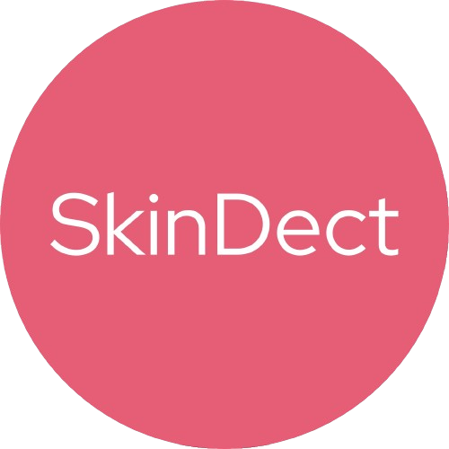

# Capstone Project

This App "SkinDect" we build to complete capstone project

# About

SkinDect is a mobile application that use machine learning to analyze some skin diseases. This application aims for affordable functions, user-friendly tools for early skin detection and monitoring. its focuses to empowering users to manage their skin health, especially in undeserved regions.

# Main Features

1. To detect users skin diseases
2. Give users recommendation how to cure and handle the users skin diseases
3. User Interface: Friendly and easy-to-use UI design

# How To Use The Application

1. Open the SkinDect application
2. Upload or take a picture of your skin disease
3. Get the result of your skin disease

# The Developer

|          Member           |  Student ID  |        Path        |                    Role                    |                                                       Contacts                                                        |
| :-----------------------: | :----------: | :----------------: | :----------------------------------------: | :-------------------------------------------------------------------------------------------------------------------: |
|      Muhammad Iqbal       | M251B4KY2908 |  Machine Learning  | Project Manager, Machine Learning Engineer |             [LinkedIn](https://www.linkedin.com/in/m-iqbal-cpu/) or [Github](https://github.com/ball-cpu)             |
| Muhammad Dimas Ardiansyah | M251B4KY2784 |  Machine Learning  |         Machine Learning Engineer          | [LinkedIn](https://www.linkedin.com/in/muhammad-dimas-ardiansyah-393b08258/) or [Github](https://github.com/0rigin4l) |
|    M.Fauzhi Azhima. M     | M251B4KY2342 |  Machine Learning  |         Machine Learning Engineer          |      [LinkedIn](https://www.linkedin.com/in/m-fauzhi-azhima-774891327/) or [Github](https://github.com/Fauzinih)      |
|  Ragil Rachmad Gustillah  | C251B4KY3616 |  Cloud Computing   |          Cloud Computing Engineer          |  [LinkedIn](https://www.linkedin.com/in/ragil-rachmad-gustillah-427532247/) or [Github](https://github.com/Rageels)   |
|   Rifky Fahriza Sinaga    | C251B4KY3844 |  Cloud Computing   |          Cloud Computing Engineer          |          [LinkedIn](https://www.linkedin.com/in/rifkysinaga/) or [Github](https://github.com/BubbleXProject)          |
|   Abdul Hafiz As Syamil   | A251B4KY0024 | Mobile Development |          Android Mobile Developer          |                                 [LinkedIn](www.linkedin.com/in/abdul-hafiz-as-syamil-30aaa7309) or [Github](https://github.com/assyamil)                                 |

# Service Architecture

<!-- # License -->

<!-- Distributed under the MIT License. See `LICENSE` for more information. -->

 Keep Going On!   C242-PS501 Teams 

